# StyA2KNet — Attention-Guided Artistic Style Transfer

[](https://www.python.org/)
[](LICENSE)


StyA2KNet is a PyTorch implementation of an attention-guided neural style transfer framework.  
The model combines a frozen VGG19 encoder, **multi-level key–query attention fusion**, and an AdaIN-inspired decoder trained with a **moment-aware perceptual loss** (content, Gram, mean/std, TV).  
The goal is to obtain high-resolution, artifact-free stylizations while keeping training numerically stable (AMP, gradient clipping, regression tests).

<p align="center">
  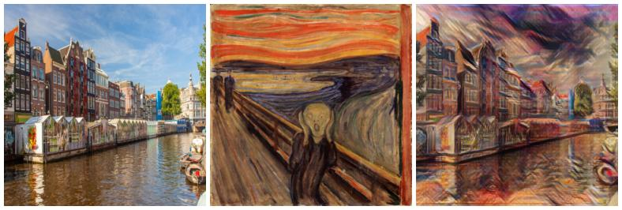
</p>

<p align="center">
  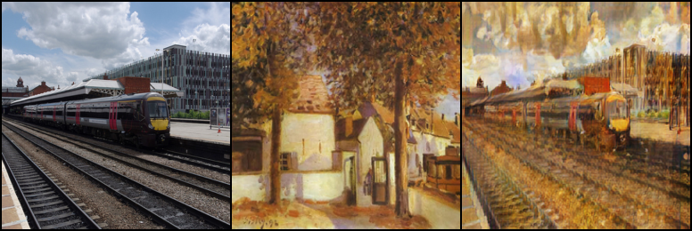
</p>

## Contents
1. [What Is Neural Style Transfer?](#what-is-neural-style-transfer)
2. [Project Highlights](#project-highlights)
3. [Results & Qualitative Comparison](#results-and-qualitative-comparison)
4. [Repository Structure](#repository-structure)
5. [Getting Started](#getting-started)
6. [Usage](#usage)
7. [Configuration & Hyperparameters](#configuration--hyperparameters)
8. [Testing](#testing)
9. [Docker Workflow](#docker-workflow)
10. [Citation](#citation)
11. [License](#license)


## What Is Neural Style Transfer?

Neural style transfer renders a *content* image in the visual style of a *style* reference by matching statistics of deep features extracted from a pretrained vision backbone (typically VGG19).  
Content is preserved via **feature reconstruction**, while style is captured by **Gram matrices** and/or **feature distribution statistics** (e.g. channel-wise mean and variance).  
Feed-forward models such as StyA2KNet approximate this optimization in a single pass, enabling real-time stylization.

In this project we focus on:

- **Attention-guided alignment** between content and style (spatial cross-attention instead of purely global statistics).
- **Moment-aware style losses**, combining Gram + mean/std matching to better control color and overall “atmosphere”.
- **Stability at scale**, using AMP + TV regularization so high-resolution stylizations remain sharp and consistent across styles.

## Project Highlights

- **Multi-level attention fusion (`StyA2KAttentionFusion`)**  
  Cross-attention blocks at deep (structure) and mid-level (color/texture) features, allowing the model to align style patterns with content geometry rather than just broadcasting global statistics.

- **Moment-aware decoder with composite perceptual loss**  
  AdaIN-inspired decoder optimized with:
  - content reconstruction (VGG features),
  - Gram-based texture matching,
  - channel-wise mean/std matching (color and global “mood”),
  - and a small TV term for spatial smoothness.

- **Baseline vs. SOTA variants baked into the repo**  
  Two model families are kept:
  - *Baseline (low)*: weaker encoder + shallow attention.
  - *SOTA (high)*: upgraded encoder + stronger attention + refined loss.  
  Qualitative tables (`samples_low/`, `samples_high/`, `training samples */`) make it easy to study how each design choice impacts visual quality.

- **Experiment-friendly training loop & diagnostics**  
  Dual dataloader iterator for content/style balancing, mixed-precision support (BF16/FP16) with a GradScaler wrapper, optional gradient clipping, and CLI configs in `src/training/` for quick ablations, plus notebooks (`showcase/`, `full_notebooks/`) and `pytest` regression tests in `testing/` to guard against silent regressions.

---

## Results and Qualitative Comparison

This section showcases the upgraded **SOTA style-transfer model**  
(enhanced encoder + attention fusion + moment-aware loss).  
We present the results in three layers:

1. **Internet-sourced stylizations (famous artworks)** – the most visually striking results.
2. **Training trajectories (SOTA vertical crops)** – how stylizations evolve across epochs.
3. **Baseline vs. SOTA research comparison** – side-by-side inference differences.

---

## 1. Internet-Sourced Stylizations (Famous Artwork Styles)

These stylizations use *unseen* artwork references from public sources  
(e.g., Monet, Van Gogh, Munch, Picasso).  
All examples come from the upgraded **SOTA model**.

<p align="center">
  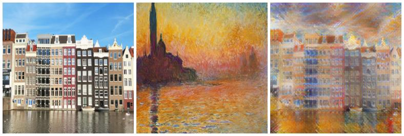
  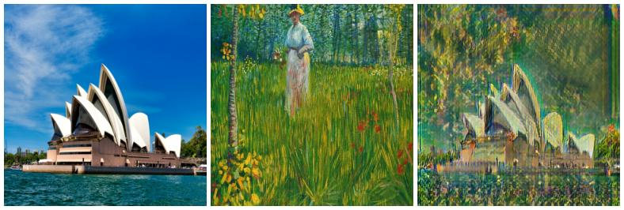
</p>

<p align="center">
  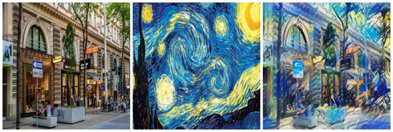
  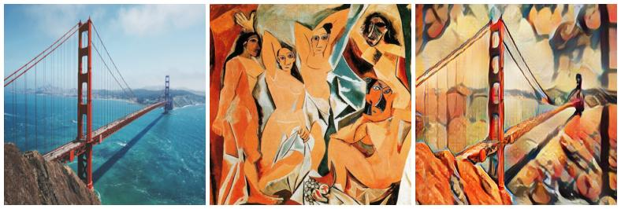
</p>


---

## 2. Training Trajectories (Vertical Crops)

The improved encoder and redesigned loss stack produce noticeably cleaner,
higher-contrast stylizations early in training.

Below is a compact **3×1 grid** of vertical crops from early SOTA epochs,
illustrating structural coherence, color consistency, and brushstroke stability:

<p align="center">
  
  
  
</p>

<p align="center">
  <sub><b>Epoch 1</b> · <b>Epoch 14</b> · <b>Epoch 24</b></sub>
</p>

Legacy training crops remain in `training samples low/` for reference.

---

## 3. Research Comparison: Baseline (Low) vs. SOTA (High)

We compare the initial **weak-attention model** (baseline)  
against the upgraded **SOTA model** with a stronger encoder, deeper fusion layers,  
and an enhanced loss design.

Each row shows the same **content × style** pair rendered by both systems.

| Baseline (low) | SOTA (high) |
| --- | --- |
| 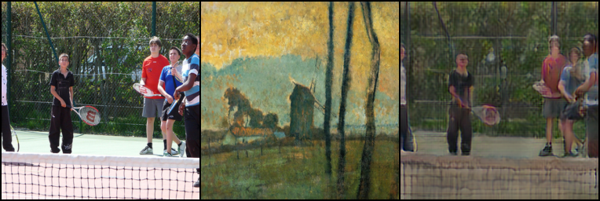 | 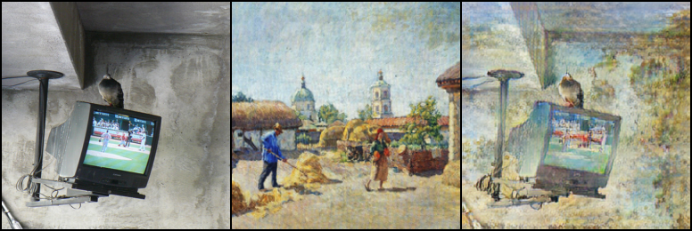 |
| 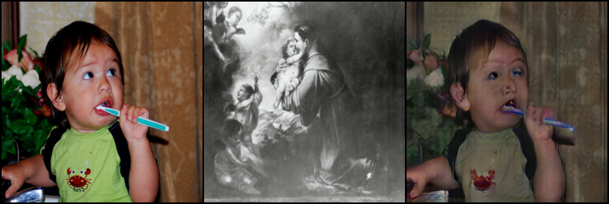 | 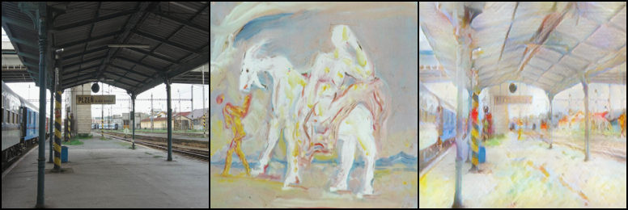 |
| 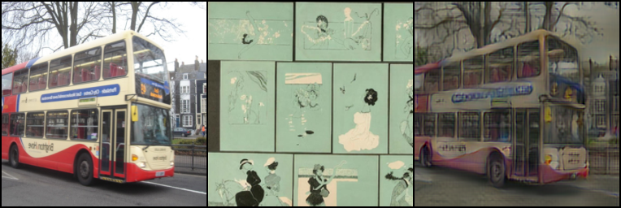 | 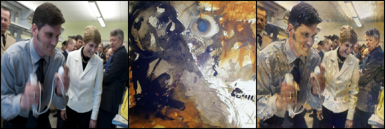 |

**SOTA improvements** include:
- tighter, more directional brushwork  
- stronger semantic alignment in attention fusion  
- improved color-moment matching  
- reduced artifacts and better global consistency

---

## Additional Qualitative Samples

- Additional SOTA inference snapshots are available in `samples_high/`
  (e.g., `sample_004.png`, `sample_008.png`, …).
- Legacy/early-training samples remain in `training samples low/` for side-by-side inspection.
- Internet experimentation results (Monet, Van Gogh, Munch, Picasso, etc.) are stored in  
  **`internet_experimentation/`**.


## Repository Structure
```
style_transfer/
├── configs/                 # YAML configs with curated defaults
├── full_notebooks/          # End-to-end training notebooks
├── showcase/                # Lightweight demo notebooks
├── src/
│   ├── data/                # Hugging Face dataset helpers and transforms
│   ├── debug/               # FP16/BF16 sanity scripts
│   ├── model/               # Encoder, decoder, attention fusion, losses
│   └── training/            # AMP utilities, loops, checkpoints
├── testing/                 # Pytest test suite for model components
├── Dockerfile
├── requirements.txt
├── configs/stya2k_base.yaml
├── LICENSE
└── README.md
```

## Getting Started

### Prerequisites
- Python 3.10+
- CUDA-capable GPU recommended (AMP is enabled by default), but CPU runs are possible for experimentation.
- A Hugging Face token if you need gated datasets (`huggingface-cli login`).

### Installation
```bash
git clone https://github.com/<your-user>/style_transfer.git
cd style_transfer
python -m venv .venv && source .venv/bin/activate
pip install --upgrade pip
pip install -r requirements.txt
```

### Dataset Preparation
The default pipeline expects COCO-style *content* images and WikiArt *style* images served via the Hugging Face Datasets API. You can swap these sources by editing `src/data/load_data.py` or overriding them via a custom script.

```python
from datasets import load_dataset
from src.data.load_data import (
    detect_image_col, filter_valid_images, cast_to_image,
    HFDataset, content_tf, style_tf, make_loader, make_train_iterator,
)

# 1) Load and clean the content dataset
coco = load_dataset("coco_captions", "2017", split="train")
content_key = detect_image_col(coco)
coco = cast_to_image(filter_valid_images(coco, content_key), content_key)
coco_ds = HFDataset(coco, img_key="image", transform=content_tf)
content_loader = make_loader(coco_ds, batch_size=32)

# 2) Load and clean the style dataset
wiki = load_dataset("huggan/wikiart", "full", split="train")
style_key = detect_image_col(wiki)
wiki = cast_to_image(filter_valid_images(wiki, style_key), style_key)
wiki_ds = HFDataset(wiki, img_key="image", transform=style_tf)
style_loader = make_loader(wiki_ds, batch_size=32)

train_iter = make_train_iterator(content_loader, style_loader)
```

> Tip: Use `truncate_dataloaders` in `src/data/load_data.py` to downsample huge datasets for quick experiments.

## Usage

### Training StyA2KNet
```python
import torch
from torch.optim import Adam
from src.model.styA2kNet import StyA2KNet
from src.model.loss import PerceptualLoss, build_vgg_loss_extractor
from src.training.train_model import train_stya2k

device = "cuda" if torch.cuda.is_available() else "cpu"
model = StyA2KNet(device=device).to(device)
loss_extractor = build_vgg_loss_extractor(device=device)
criterion = PerceptualLoss(loss_extractor)
optimizer = Adam(model.parameters(), lr=1e-4)

state = train_stya2k(
    model=model,
    criterion=criterion,
    optimizer=optimizer,
    device=device,
    epochs=40,
    grad_clip=1.0,
    amp_enabled=True,
    amp_dtype="bf16",
    run_name="StyA2KNet",
    content_loader=content_loader,
    style_loader=style_loader,
)
```

The trainer automatically:
- Uses BF16/FP16 autocast + GradScaler (when appropriate).
- Logs aggregated losses every `log_every` steps.
- Saves sampled triplets (`content/style/output`) in `samples_stya2k/`.
- Returns checkpoint metadata so you can resume mid-run.

### CLI Scripts
Prefer Python scripts over notebooks? Launch training or inference headlessly:

```bash
# Training with the default config
python scripts/train.py --config configs/stya2k_base.yaml --checkpoint-out checkpoints/stya2k_latest.pt

# Stylize an image pair
python scripts/infer.py \
  --checkpoint checkpoints/stya2k_latest.pt \
  --content path/to/content.jpg \
  --style path/to/style.jpg \
  --output stylized.png
```
Both scripts mirror the notebook logic: the trainer loads Hugging Face datasets, while the inference script applies the trained weights to any RGB pair and writes the denormalized output.

### Saving & Resuming
Use `src/training/chekpoint.py`:
```python
from src.training.chekpoint import save_checkpoint, load_checkpoint
save_checkpoint("checkpoints/stya2k_e040.pt", model, optimizer, epoch=40, global_step=state["global_step"])
```

### Stylizing Images
After training, run inference by forwarding content/style tensors through the model:
```python
with torch.no_grad():
    y = model(x_content.to(device), x_style.to(device))
```
`src/data/data_utils.py` includes helpers such as `denorm` and `show_examples` for quick visualization.

## Configuration & Hyperparameters
- `configs/stya2k_base.yaml` captures the canonical experiment setup (batch size, dataset sizes, attention dims, optimizer, AMP flags, etc.).
- Override it or create a new YAML under `configs/` to track alternate runs.
- Surface-level toggles:
  - `model.fusion.key_dim`: attention bottleneck.
  - `model.decoder.out_size`: output resolution.
  - `loss.content_weights` / `loss.style_weights`: perceptual balance.
  - `training.amp_dtype` / `training.grad_clip`: mixed-precision safety.

## Testing
Run the regression suite to ensure architectural components behave as expected:
```bash
pytest testing
```
`testing/test_models.py` covers the attention fusion block, decoder, and the end-to-end StyA2KNet forward pass through a mocked VGG encoder.

## Docker Workflow
Build and run a reproducible GPU-ready environment:
```bash
docker build -t stya2knet .
docker run --gpus all -it --rm -v $PWD:/workspace stya2knet bash
```
Inside the container, dependencies from `requirements.txt` are already installed and `PYTHONPATH` points to `/workspace`.

## Optional Accelerations
- **Multi-GPU / DDP:** Launch `scripts/train.py` via `torchrun --nproc_per_node=<gpus>` and wrap the model with `torch.nn.parallel.DistributedDataParallel`. Replace the dataloaders with `DistributedSampler` equivalents to shard batches across workers.
- **Mixed precision tweaks:** Adjust `training.amp_enabled` / `training.amp_dtype` in `configs/*.yaml` to switch between BF16 and FP16 depending on the hardware. When training on CPU or low-memory GPUs, disable AMP entirely.
- **Gradient accumulation & clipping:** The training loop already exposes `grad_clip`; for accumulation, modify `train_one_epoch` to step the optimizer every `accumulate_steps` to simulate larger effective batches without extra memory.
- **Experiment tracking:** Hook services like Weights & Biases or TensorBoard inside `train_one_epoch` / `train_stya2k` by logging the aggregated metrics the functions already produce at each epoch.

## Citation
If this codebase helps your research, please cite the foundational works that inspired StyA2KNet:
```
@inproceedings{zhu2023all,
  title     = {All-to-Key Attention for Arbitrary Style Transfer},
  author    = {Zhu, Mingrui and He, Xiao and Wang, Nannan and Wang, Xiaoyu and Gao, Xinbo},
  booktitle = {Proceedings of the IEEE/CVF International Conference on Computer Vision (ICCV)},
  year      = {2023},
  pages     = {23052--23062}
}

@article{simonyan2014vgg,
  title={Very Deep Convolutional Networks for Large-Scale Image Recognition},
  author={Simonyan, Karen and Zisserman, Andrew},
  journal={arXiv:1409.1556}, year={2014}
}
```

## License
This project is distributed under the [MIT License](LICENSE). Feel free to use it in research or production with attribution.
